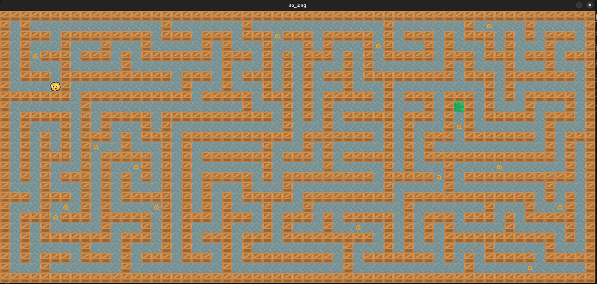

*This project has been created as part of the 42 curriculum by amtan.*

# so\_long



## Description

`so_long` is a small 2D game written in C for the 42 School curriculum. The goal is to load a `.ber` map, render it with MiniLibX, move the player through the map, collect every collectible, and then reach the exit.

This implementation uses:

*   **MiniLibX** for the window, keyboard hooks, XPM textures, and frame rendering.

*   **libft** for utility functions, `ft_printf`style output, and `get_next_line`.

*   **Map validation** to reject malformed maps before the game starts.

*   **Flood-fill reachability checking** to ensure the player can reach every collectible and the exit.

*   **A simple tile renderer** using 32×32 XPM sprites for floor, wall, player, collectible, and exit tiles.

The executable is named:

```bash
so_long
```

## Features

*   Parses a map file passed as a single command-line argument.

*   Requires the map file to use the `.ber` extension.

*   Validates that the map is rectangular.

*   Validates that the map is fully surrounded by walls.

*   Accepts only the required map characters: `0`, `1`, `C`, `E`, and `P`.

*   Requires exactly one player start position `P`.

*   Requires exactly one exit `E`.

*   Requires at least one collectible `C`.

*   Checks that all collectibles and the exit are reachable from the player start.

*   Displays the game in a MiniLibX window.

*   Supports movement with **W/A/S/D** and the **arrow keys**.

*   Blocks movement into walls.

*   Prints the move count in the terminal after each successful move.

*   Prevents winning until every collectible has been collected.

*   Exits cleanly with **ESC** or the window close button.

*   Frees loaded images, the framebuffer, the map, and the MiniLibX display during cleanup.

## Project Structure

```plain text
.
├── Makefile
├── include/
│   └── so_long.h
├── libft/
├── maps/
│   ├── 00_ok_small.ber
│   ├── 00_ok_maze_25x15.ber
│   ├── 00_ok_maze_33x19.ber
│   ├── 00_ok_maze_40x22.ber
│   ├── 00_ultimate.ber
│   └── invalid test maps
├── minilibx-linux/
├── src/
│   ├── app.c
│   ├── app_run.c
│   ├── args.c
│   ├── game.c
│   ├── game_move.c
│   ├── map_load.c
│   ├── map_validate_basic.c
│   ├── map_validate_charset.c
│   ├── map_validate_path.c
│   ├── render.c
│   └── ...
└── textures/
    ├── collect.xpm
    ├── exit.xpm
    ├── floor.xpm
    ├── player.xpm
    └── wall.xpm
```

## Instructions

### Requirements

This project is built for Linux with MiniLibX. On Debian/Ubuntu-based systems, the following packages are typically needed for MiniLibX/X11 builds:

```bash
sudo apt-get update
sudo apt-get install -y build-essential xorg libx11-dev libxext-dev zlib1g-dev
```

The repository includes `minilibx-linux/` and `libft/`, and the main `Makefile` builds them as dependencies.

### Build

From the repository root:

```bash
make
```

This builds:

```bash
./so_long
```

Available Makefile targets:

```bash
make        # build so_long
make clean  # remove object files
make fclean # remove object files and executable
make re     # rebuild from scratch
```

### Run

Run the game with one `.ber` map file:

```bash
./so_long maps/00_ok_small.ber
```

Other valid example maps included in the repository:

```bash
./so_long maps/00_ok_maze_25x15.ber
./so_long maps/00_ok_maze_33x19.ber
./so_long maps/00_ok_maze_40x22.ber
./so_long maps/00_ultimate.ber
```

### Controls

| Key                 | Action        |
| ------------------- | ------------- |
| `W` or `↑`          | Move up       |
| `A` or `←`          | Move left     |
| `S` or `↓`          | Move down     |
| `D` or `→`          | Move right    |
| `ESC`               | Quit the game |
| Window close button | Quit the game |

Each successful movement prints the current move count in the shell:

```plain text
Moves: 1
Moves: 2
Moves: 3
```

## Map Format

A valid map must use only the following characters:

| Character | Meaning      |
| --------- | ------------ |
| `0`       | Empty floor  |
| `1`       | Wall         |
| `C`       | Collectible  |
| `E`       | Exit         |
| `P`       | Player start |

Example valid map:

```plain text
11111
1P0C1
10001
1E001
11111
```

Validation rules:

*   The file must have a `.ber` extension.

*   The map must not be empty.

*   The map must be rectangular.

*   The map must be surrounded by walls.

*   The map must contain only `0`, `1`, `C`, `E`, and `P`.

*   The map must contain exactly one `P`.

*   The map must contain exactly one `E`.

*   The map must contain at least one `C`.

*   The player must be able to reach every collectible and the exit.

If a map is invalid, the program prints:

```plain text
Error
<explicit error message>
```

Examples of invalid test maps are included in `maps/`, such as maps with bad rectangles, missing exits, duplicate players, invalid characters, or unreachable collectibles.

## Technical Choices

### Map loading

The map is first measured, then loaded into a `char **grid`. End-of-line characters are stripped so validation works on the actual map content.

### Map validation

Validation is split into small steps:

*   Check that the map is non-empty.

*   Check that all rows have the same width.

*   Check that the border is made of walls.

*   Check allowed characters and required counts.

*   Run a flood-fill traversal from the player position.

The flood-fill pass duplicates the grid, walks reachable cells, counts reachable collectibles, and confirms that the exit can be reached. The original map is not modified during this check.

### Rendering

The program creates a MiniLibX window sized from the map dimensions:

```plain text
window width  = map width  × 32
window height = map height × 32
```

Rendering is done into a framebuffer image before the framebuffer is pushed to the window. Each tile is drawn from an XPM texture:

*   `textures/floor.xpm`

*   `textures/wall.xpm`

*   `textures/player.xpm`

*   `textures/collect.xpm`

*   `textures/exit.xpm`

A color key is used while blitting textures so transparent-style pixels are skipped.

### Game loop

MiniLibX hooks are used for:

*   key press events,

*   expose/redraw events,

*   window close events.

The game updates only when the player moves. It is not a real-time game.

### Cleanup

The program destroys images, textures, the window, the MiniLibX display, and the allocated map before exiting.

## Testing

### Build test

```bash
make
```

### Run valid maps

```bash
./so_long maps/00_ok_small.ber
./so_long maps/00_ok_maze_25x15.ber
./so_long maps/00_ultimate.ber
```

### Run invalid maps

These should print `Error` followed by a clear message:

```bash
./so_long maps/01_empty.ber
./so_long maps/02_bad_rect_short_row.ber
./so_long maps/03_bad_walls_top_hole.ber
./so_long maps/04_bad_char_X.ber
./so_long maps/05_bad_counts_no_exit.ber
./so_long maps/06_bad_counts_two_exits.ber
./so_long maps/07_bad_counts_two_players.ber
./so_long maps/08_bad_counts_no_collectible.ber
./so_long maps/09_bad_path_unreachable_C.ber
./so_long maps/x_not_a_ber_file_.txt
```

### Memory checks

When MiniLibX and X11 are available, Valgrind can be used to check for leaks:

```bash
valgrind --leak-check=full --show-leak-kinds=all ./so_long maps/00_ok_small.ber
```

Some MiniLibX/X11 allocations may appear as still reachable depending on the local graphics environment. The important part is to verify that project-owned allocations are cleaned up.

## Resources

Classic references and documentation related to this project:

*   MiniLibX Linux repository: <https://github.com/42paris/minilibx-linux>

*   42 Docs — MiniLibX Getting Started: <https://harm-smits.github.io/42docs/libs/minilibx/getting_started.html>

*   42 Docs — MiniLibX Events: <https://harm-smits.github.io/42docs/libs/minilibx/events.html>

*   Linux man pages for `open`, `close`, `read`, `write`, `malloc`, `free`, `perror`, `strerror`, and `exit`: <https://man7.org/linux/man-pages/>

*   MiniLibX header and source included in this repository under `minilibx-linux/`

*   Classic flood-fill / graph traversal concept for validating reachability in grid-based maps

*   42 `so_long` subject PDF

### AI usage

AI was used as a documentation and study aid for this repository. Specifically, ChatGPT was used to:

*   organize the README structure around the 42 README requirements,

*   summarize the project behavior from the inspected source files,

*   explain MiniLibX, map validation, flood-fill reachability, and cleanup concepts,

*   suggest testing sections and GitHub repository metadata,

*   improve wording for peers, staff, and recruiters.

AI was not used as an authoritative source for project rules. The README content was checked against the provided 42 subject requirements and the actual code structure in this repository.
